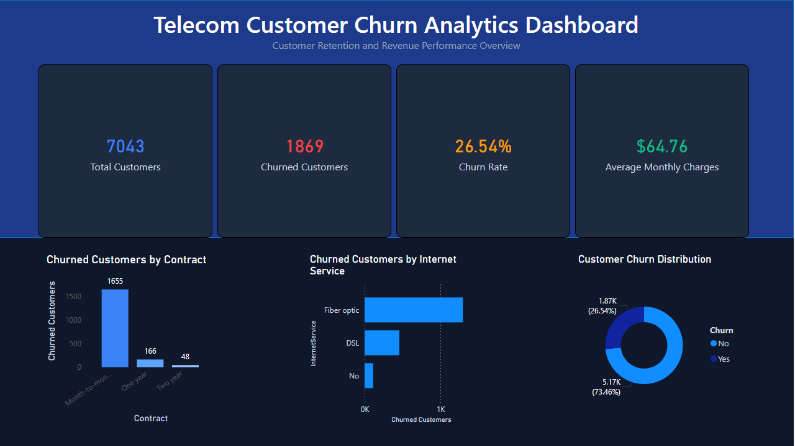

# Telecom Customer Churn Analytics Dashboard

## Project Overview

This project analyzes customer churn within a telecommunications company using Power BI. The dashboard was designed to provide business stakeholders with actionable insights into customer retention, contract performance, and service-related churn patterns.

## Business Problem

Customer churn is a critical challenge for telecommunications providers because it directly impacts revenue and customer lifetime value. The objective of this analysis was to identify customer segments with elevated churn risk and provide insights that can support retention-focused business strategies.

## Dataset

The analysis uses the IBM Telco Customer Churn dataset containing over 7,000 customer records, including:

* Customer demographics
* Contract types
* Internet service subscriptions
* Monthly charges
* Customer tenure
* Churn status

## Dashboard Features

### Key Performance Indicators (KPIs)

* Total Customers
* Churned Customers
* Churn Rate
* Average Monthly Charges

### Visualizations

* Churned Customers by Contract Type
* Churned Customers by Internet Service
* Customer Churn Distribution

## Key Findings

* Overall churn rate is 26.54%.
* Month-to-month contracts account for the majority of churned customers.
* Fiber optic customers demonstrate significantly higher churn than DSL customers.
* Long-term contracts are associated with improved customer retention.
* Approximately 1,869 customers have churned from a customer base of 7,043.

## Business Recommendations

* Develop retention campaigns targeting month-to-month subscribers.
* Evaluate customer experience and pricing strategies for fiber optic services.
* Promote longer-term contracts through loyalty incentives and discounts.
* Focus retention efforts on high-risk customer segments identified through churn analysis.

## Tools & Technologies

* Power BI
* Power Query
* DAX
* Data Visualization
* Business Analytics

## Skills Demonstrated

* KPI Development
* Data Transformation
* Dashboard Design
* Customer Analytics
* Business Analysis
* Data Storytelling

## Dashboard Preview

## Author

Skyler Johnson
